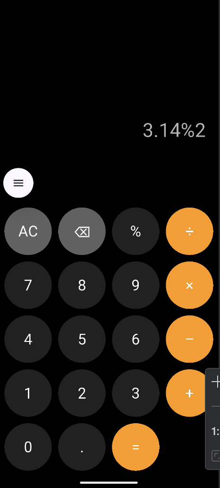

# 📱 iPhone-style Calculator (Flutter)

Простое приложение-калькулятор, стилизованное под интерфейс iPhone.   
Реализовано на Flutter с нуля, с экранной клавиатурой, поддержкой дробей и базовых операций.

---

## 📸 Скриншот

---

## ✨ Возможности

- Ввод чисел через экранные кнопки
- Поддержка операций: `+`, `–`, `×`, `÷`
- Поддержка десятичных чисел
- Очистка (AC), удаление символов (⌫)
- Вывод результата по нажатию `=`
- Темная тема, похожая на оригинальный калькулятор iOS

---

